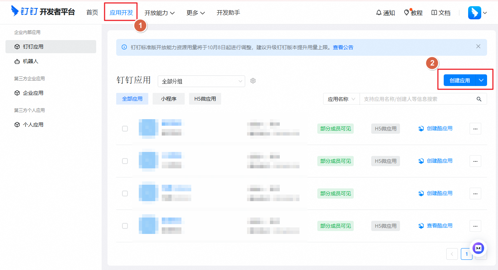
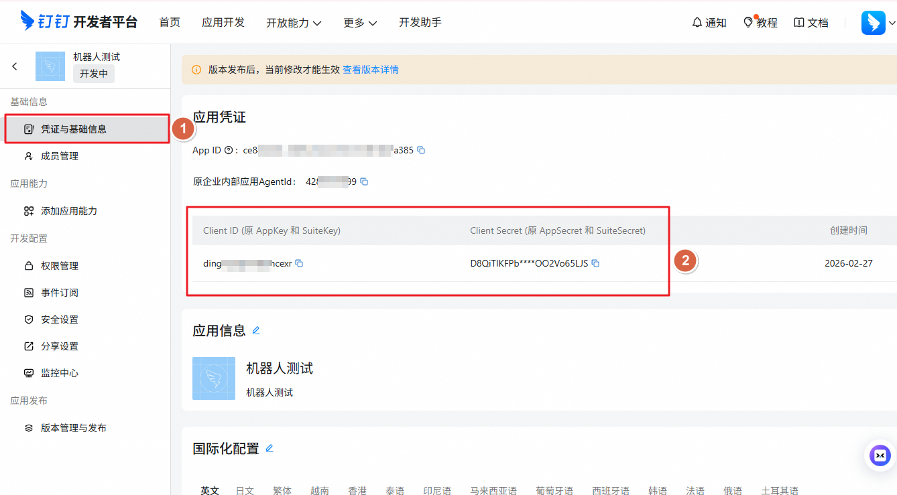
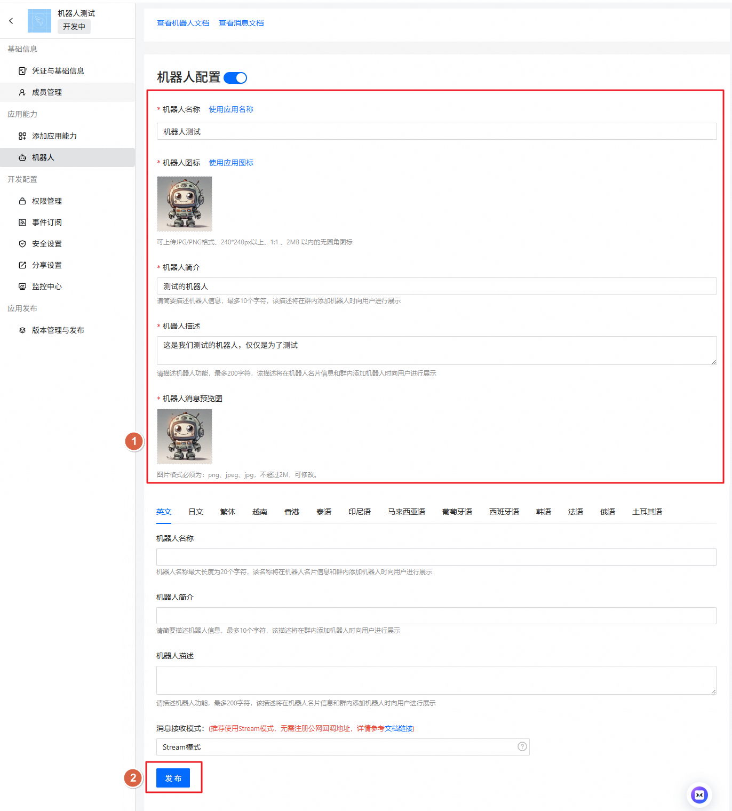

# 钉钉机器人

状态：生产就绪，支持机器人私聊和群组。使用 Stream 长连接模式接收消息，支持流式 AI Card 回复。

---

## 快速开始

添加钉钉渠道有两种方式：

### 方式一：通过安装向导添加（推荐）

如果您刚安装完 Openclaw，可以直接运行向导，根据提示添加钉钉：

```bash
openclaw-cn onboard
```

向导会引导您完成：

1. 安装官方钉钉插件
2. 输入应用 Client ID 和 Client Secret
3. 输入 Gateway Token
4. 启动网关

✅ **完成配置后**，您可以使用以下命令检查网关状态：

- `openclaw-cn gateway status` - 查看网关运行状态
- `openclaw-cn logs --follow` - 查看实时日志

### 方式二：通过命令行添加

如果您已经完成了初始安装，可以用以下命令添加钉钉渠道：

```bash
openclaw-cn channels add
```

然后根据交互式提示选择 **钉钉 (官方连接器)**，按提示输入三个必填参数即可。

✅ **完成配置后**：

- `openclaw-cn gateway status` - 查看网关运行状态
- `openclaw-cn gateway restart` - 重启网关以应用新配置
- `openclaw-cn logs --follow` - 查看实时日志

---

## 第一步：创建钉钉应用

### 1. 打开钉钉开放平台

访问 [钉钉开放平台开发者后台](https://open-dev.dingtalk.com)，使用钉钉账号（需要企业管理员或开发者权限）登录。

### 2. 创建企业内部应用

1. 点击左侧菜单 **应用开发** > **企业内部开发**
2. 点击 **创建应用**
3. 选择 **钉钉应用**，填写应用名称和描述



### 3. 获取应用凭证

进入应用详情页，在 **基础信息** 页面复制：

- **Client ID**（即 AppKey，格式如 `dingxxxxxx`）
- **Client Secret**（即 AppSecret）

❗ **重要**：请妥善保管 Client Secret，不要分享给他人。



### 4. 开启机器人能力

在应用详情页，进入 **添加应用能力** > **机器人**：

1. 点击 **添加** 开启机器人能力
2. 在机器人配置中填写机器人名称和描述
3. **消息接收模式** 选择 **Stream 模式**（无需公网服务器）



### 5. 配置权限

在 **权限管理** 页面，搜索并添加以下三个必要权限：

| 权限名称               | 说明                                      |
| ---------------------- | ----------------------------------------- |
| `Card.Streaming.Write` | 向 AI Card 推送流式内容（打字机效果必需） |
| `Card.Instance.Write`  | 创建和更新 AI Card 实例                   |
| `qyapi_robot_sendmsg`  | 机器人发送消息                            |

> **提示**：根据您的实际需求，可能还需要添加文档读写等其他权限。

### 6. 发布应用

1. 在 **版本管理与发布** 页面点击 **创建新版本**
2. 填写版本说明后提交
3. 选择应用可见范围（建议先设为 **全员** 进行测试）
4. 点击 **确认发布**

---

## 第二步：配置 Openclaw

### 通过向导配置（推荐）

运行以下命令，根据提示依次输入三个必填参数：

```bash
openclaw-cn channels add
```

选择 **钉钉 (官方连接器)**，然后按提示安装官方插件并输入凭证：

```
◇  安装 钉钉 插件?
│  钉钉官方插件

◇  输入钉钉应用 Client ID
│  dingxxxxxxxxxxxxxx

◇  输入钉钉应用 Client Secret
│  xxxxxxxxxxxxxxxxxxxxxxxxxxxxxxxx

◇  输入 Gateway 认证 Token（openclaw.json 中 gateway.auth.token 的值）
│  your-gateway-token
```

> **Gateway Token 说明**：钉钉官方插件通过 HTTP 请求本地 Gateway，需要认证 Token。如果您尚未配置 `gateway.auth.token`，可以先设置一个随机字符串（例如运行 `openssl rand -hex 16` 生成），在两处填写相同的值即可。

### 通过配置文件配置

编辑 `~/.openclaw/openclaw.json`：

```json
{
  "channels": {
    "dingtalk-connector": {
      "enabled": true,
      "clientId": "dingxxxxxxxxxxxxxx",
      "clientSecret": "xxxxxxxxxxxxxxxxxxxxxxxxxxxxxxxx",
      "gatewayToken": "your-gateway-token",
      "dmPolicy": "pairing"
    }
  },
  "gateway": {
    "auth": {
      "mode": "token",
      "token": "your-gateway-token"
    },
    "http": {
      "endpoints": {
        "chatCompletions": {
          "enabled": true
        }
      }
    }
  }
}
```

> **重要**：`channels.dingtalk-connector.gatewayToken` 必须与 `gateway.auth.token` 保持一致，官方插件通过此 Token 验证 Gateway 身份。

---

## 第三步：启动并测试

### 1. 启动网关

```bash
openclaw-cn gateway
```

### 2. 验证连接

网关启动后，查看日志确认钉钉 Stream 连接成功：

```bash
openclaw-cn logs --follow
```

正常启动日志应包含：

```
[dingtalk-connector] [__default__] 启动钉钉 Stream 客户端...
[dingtalk-connector] [__default__] 钉钉 Stream 客户端已连接
```

### 3. 发送测试消息

在钉钉中找到您创建的机器人（可通过搜索机器人名称找到），发送一条消息。

### 4. 配对授权

默认情况下，机器人会回复一个 **配对码**。您需要批准此代码：

```bash
openclaw-cn pairing approve dingtalk-connector <配对码>
```

批准后即可正常对话，机器人将以流式 AI Card 形式实时输出回复。

---

## 介绍

- **钉钉机器人渠道**：通过官方 `@dingtalk-real-ai/dingtalk-connector` 插件接入
- **Stream 长连接**：无需公网服务器，钉钉主动推送消息到本地网关
- **流式 AI Card**：回复以卡片形式呈现，支持实时打字机效果
- **确定性路由**：回复始终返回钉钉，模型不会选择渠道
- **会话隔离**：私聊共享主会话；群组独立隔离

---

## 访问控制

### 私聊访问

- **默认**：`dmPolicy: "pairing"`，陌生用户会收到配对码
- **批准配对**：
  ```bash
  openclaw-cn pairing list dingtalk-connector      # 查看待审批列表
  openclaw-cn pairing approve dingtalk-connector <CODE>  # 批准
  ```
- **白名单模式**：通过 `channels.dingtalk-connector.allowFrom` 配置允许的用户 staffId

### 群组访问

**群组策略**（`channels.dingtalk-connector.groupPolicy`）：

- `"open"` = 允许群组中所有人（默认）
- `"allowlist"` = 仅允许 `groupAllowFrom` 中的用户
- `"disabled"` = 禁用群组消息

---

## 获取用户 staffId

用户 staffId 可通过以下方式获取：

**方法一**（推荐）：

1. 启动网关并给机器人发消息
2. 运行 `openclaw-cn logs --follow` 查看日志中的 `senderStaffId` 字段

**方法二**：

查看配对请求列表：

```bash
openclaw-cn pairing list dingtalk-connector
```

---

## 常用命令

| 命令      | 说明           |
| --------- | -------------- |
| `/status` | 查看机器人状态 |
| `/reset`  | 重置对话会话   |
| `/model`  | 查看/切换模型  |

## 网关管理命令

| 命令                          | 说明              |
| ----------------------------- | ----------------- |
| `openclaw-cn gateway status`  | 查看网关运行状态  |
| `openclaw-cn gateway install` | 安装/启动网关服务 |
| `openclaw-cn gateway stop`    | 停止网关服务      |
| `openclaw-cn gateway restart` | 重启网关服务      |
| `openclaw-cn logs --follow`   | 实时查看日志输出  |

---

## 故障排除

### 机器人不响应消息

1. 确认 Stream 连接已建立：查看日志是否有 `钉钉 Stream 客户端已连接`
2. 确认应用已发布且机器人能力已开启
3. 确认消息接收模式为 **Stream 模式**（非 HTTP 回调）
4. 查看日志：`openclaw-cn logs --follow`

### Gateway Token 认证失败

错误日志包含 `401` 或 `认证失败` 时：

1. 确认 `channels.dingtalk-connector.gatewayToken` 与 `gateway.auth.token` 相同
2. 确认 `gateway.http.endpoints.chatCompletions.enabled: true`
3. 重新运行配置向导更新凭证：`openclaw-cn channels add`

### Client ID / Client Secret 错误

1. 在钉钉开放平台检查应用状态是否为已发布
2. 重新复制 **Client ID** 和 **Client Secret**（注意不要混淆 AppKey/AppSecret）
3. 更新配置：`openclaw-cn channels add`，重新选择钉钉并输入正确凭证

### 机器人在群组中不响应

1. 确认机器人已被添加到该群组
2. 确认 `groupPolicy` 不为 `"disabled"`
3. 在群组中 @ 机器人后发送消息（默认需要 @）
4. 查看日志：`openclaw-cn logs --follow`

### Client Secret 泄露怎么办

1. 在钉钉开放平台重置 Client Secret
2. 运行 `openclaw-cn channels add` 重新配置
3. 重启网关

---

## 高级配置

### 多 Agent 路由

通过 `bindings` 配置，您可以用一个钉钉机器人对接多个不同功能的 Agent：

```json
{
  "agents": {
    "list": [
      { "id": "main" },
      {
        "id": "assistant",
        "workspace": "~/assistant-workspace"
      }
    ]
  },
  "bindings": [
    {
      "agentId": "main",
      "match": {
        "channel": "dingtalk-connector",
        "peer": {
          "kind": "dm",
          "id": "staff_id_xxx"
        }
      }
    },
    {
      "agentId": "assistant",
      "match": {
        "channel": "dingtalk-connector",
        "peer": {
          "kind": "group",
          "id": "group_id_xxx"
        }
      }
    }
  ]
}
```

**匹配规则说明**：

| 字段              | 说明                                          |
| ----------------- | --------------------------------------------- |
| `agentId`         | 目标 Agent 的 ID，需要在 `agents.list` 中定义 |
| `match.channel`   | 渠道类型，固定为 `"dingtalk-connector"`       |
| `match.peer.kind` | 对话类型：`"dm"`（私聊）或 `"group"`（群组）  |
| `match.peer.id`   | 用户 staffId 或群组 conversationId            |

---

## 完整配置示例

```json
{
  "channels": {
    "dingtalk-connector": {
      "enabled": true,
      "clientId": "dingxxxxxxxxxxxxxxxxxx",
      "clientSecret": "xxxxxxxxxxxxxxxxxxxxxxxxxxxxxxxxxxxxxxxx",
      "gatewayToken": "your-gateway-token",
      "dmPolicy": "pairing",
      "groupPolicy": "open",
      "allowFrom": ["staff_id_xxx"],
      "groupAllowFrom": ["staff_id_xxx", "staff_id_yyy"]
    }
  },
  "gateway": {
    "auth": {
      "mode": "token",
      "token": "your-gateway-token"
    },
    "http": {
      "endpoints": {
        "chatCompletions": {
          "enabled": true
        }
      }
    }
  }
}
```

---

## 配置参考

| 配置项                                           | 说明                            | 默认值    |
| ------------------------------------------------ | ------------------------------- | --------- |
| `channels.dingtalk-connector.enabled`            | 启用/禁用渠道                   | `true`    |
| `channels.dingtalk-connector.clientId`           | 应用 Client ID（AppKey）        | -         |
| `channels.dingtalk-connector.clientSecret`       | 应用 Client Secret（AppSecret） | -         |
| `channels.dingtalk-connector.gatewayToken`       | Gateway 认证 Token              | -         |
| `channels.dingtalk-connector.dmPolicy`           | 私聊策略                        | `pairing` |
| `channels.dingtalk-connector.allowFrom`          | 私聊白名单（staffId 列表）      | -         |
| `channels.dingtalk-connector.groupPolicy`        | 群组策略                        | `open`    |
| `channels.dingtalk-connector.groupAllowFrom`     | 群组白名单                      | -         |
| `gateway.auth.mode`                              | 网关认证模式                    | -         |
| `gateway.auth.token`                             | 网关认证 Token                  | -         |
| `gateway.http.endpoints.chatCompletions.enabled` | 启用 HTTP Chat Completions      | `false`   |

---

## dmPolicy 策略说明

| 值            | 行为                                               |
| ------------- | -------------------------------------------------- |
| `"pairing"`   | **默认**。未知用户收到配对码，管理员批准后才能对话 |
| `"allowlist"` | 仅 `allowFrom` 列表中的用户可对话，其他静默忽略    |
| `"open"`      | 允许所有人对话（需在 allowFrom 中加 `"*"`）        |
| `"disabled"`  | 完全禁止私聊                                       |

---

## 支持的消息类型

### 接收

- ✅ 文本消息
- ✅ 图片
- ✅ 文件
- ✅ 音频
- ✅ 视频
- ✅ @提及

### 发送

- ✅ 流式 AI Card（实时打字机效果）
- ✅ 文本消息
- ✅ 图片
- ✅ 文件
- ✅ 音频
- ✅ 视频